# bevy-aqua

[](https://crates.io/crates/bevy-aqua)

## [Try the live WebGPU demos →](https://sayhisam1.github.io/bevy-aqua/)

Camera-centred ocean rendering for Bevy 0.19 with analytic and FFT waves,
depth-aware transmission, reflections, persistent foam, localized water
bodies, and GPU surface queries.

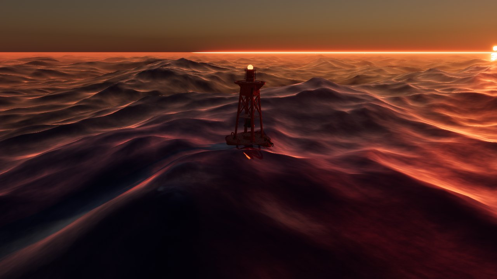

## Features

- Five camera-centred displacement cascades with smooth LOD blending.
- Crest-style analytic waves or Tessendorf spectral waves.
- Beer-Lambert transmission, refraction, reflections, scene lighting, and
  underwater mesh incident lighting.
- Persistent whitecaps and shoreline foam.
- Static terrain heightfields for shoaling and shallow-water optics.
- Bounded ponds, lakes, and river corridors with per-body optics.
- GPU `WaveQuery` samples for buoyancy and gameplay.
- Optional budgeted Hanabi spray.
- Native desktop and browser WebGPU/Wasm rendering.

## Highlights

| FFT open ocean | Coastal foam and shallow-water optics |
|---|---|
| 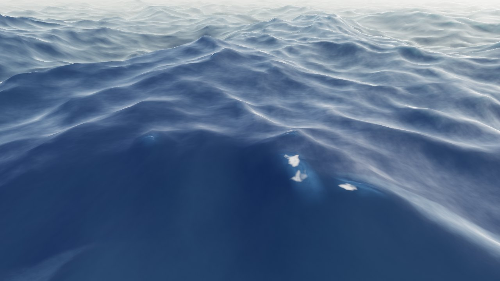 | 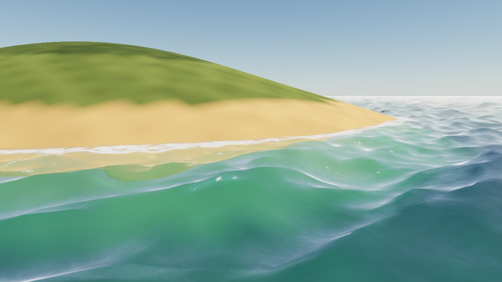 |

| Bounded river corridor | Planar reflection |
|---|---|
| 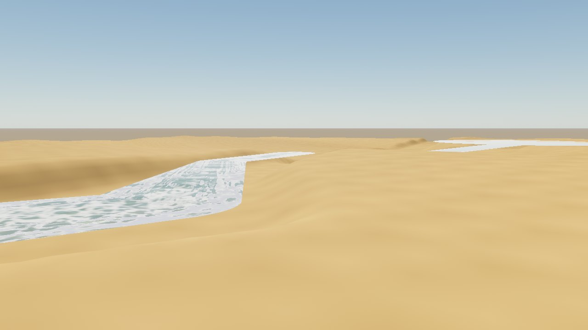 | 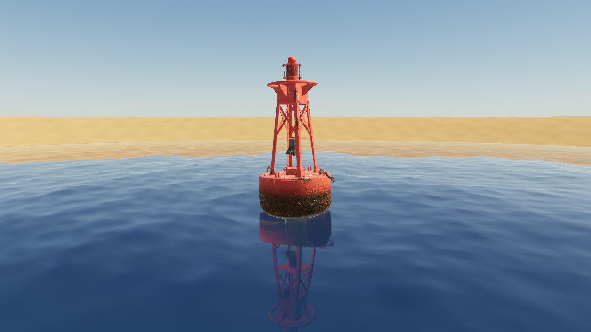 |

## Compatibility

| bevy-aqua | Bevy | Rust | Verified target |
|---|---|---|---|
| 0.1 | 0.19 | 1.95+ | Desktop Vulkan and browser WebGPU (Wasm) |

Browser WebGPU/Wasm support was contributed by
[@wellscrosby](https://github.com/wellscrosby) in [#1](https://github.com/sayhisam1/bevy-aqua/pull/1).

The default `query` and `reflect` features enable GPU wave probes and planar
reflections. The optional `spray` feature adds `bevy-aqua-spray` and `bevy_hanabi`,
implies `query`, and defaults to `Off` at runtime. Mobile and other desktop APIs
are not yet verified.

## Quick start

```rust
use bevy::{core_pipeline::prepass::DepthPrepass, prelude::*};
use bevy_aqua::{AquaPlugin, Ocean};

fn main() {
    App::new()
        .insert_resource(Ocean::default())
        .add_plugins((DefaultPlugins, AquaPlugin))
        .add_systems(Startup, |mut commands: Commands| {
            commands.spawn((
                Camera3d::default(),
                DepthPrepass,
                Transform::from_xyz(24.0, 12.0, 32.0)
                    .looking_at(Vec3::ZERO, Vec3::Y),
            ));
            commands.spawn((
                DirectionalLight::default(),
                Transform::from_rotation(Quat::from_euler(
                    EulerRot::XYZ,
                    -0.8,
                    -0.6,
                    0.0,
                )),
            ));
        })
        .run();
}
```

Insert one `Ocean` resource. `Ocean::level` sets the global sea level. Remove
the resource for bounded-water-only worlds. One active `Camera3d` is the
supported view path.

## Configuration

Insert `OceanWaves` and `AquaSettings` before `AquaPlugin` to replace their
defaults.

`OceanWaves` selects `WaveModel::Analytic` or `WaveModel::Spectral`. It also
sets sea state, shallow-water attenuation, wind direction and speed, fetch,
and world-XZ flow. `sea_state`, wind, and fetch determine startup spectrum
data; set them before the plugin starts.

`AquaSettings` selects a `WaterOptics` preset and a `detail_strength` in
`0..=2`. `WaterOptics::DEEP_OCEAN` is the default. Coastal, tropical, and
clear-fresh presets are also provided. Extinction, particle scatter,
molecular Rayleigh, and Henyey-Greenstein `scattering_asymmetry` live on
that optics profile. When
the camera is below the local surface, a fullscreen volume pass applies the
same medium. Opaque colour in that medium is scaled by the surface-to-hit
sun path from the depth buffer, so underwater meshes go dark and blue-green
without a special material. `far_tier_start` and `far_tier_end`
bound the reduced-cost shading transition in metres. Far shading keeps sun
and reflections while omitting depth, foam, and sampled subsurface detail.
`reflections` selects the default planar mirror views or the byte-compatible cubemap-only path. Mark terrain or a
scene root with `ReflectedInWater` to include it and its descendants in planar
views. `caustics` controls the default procedural shallow-bed lighting; set it
to `None` to skip both texture samples. Hosts can update
`CausticsSunVisibility` to fold cloud-shadow coverage into the direct sun.

### Terrain bed

Insert a `BedHeightMap` before `AquaPlugin`. Its single-channel image stores
normalized height. `origin` is the world-XZ centre of texel `(0, 0)`, `size`
is the distance from the first to last texel centres, and `height_range`
decodes normalized values to metres.

```rust,ignore
commands.insert_resource(BedHeightMap {
    image: terrain_heightmap,
    origin: Vec2::splat(-10_000.0),
    size: Vec2::splat(20_000.0),
    height_range: [0.0, 1_808.0],
});
```

Without a bed map, Aqua uses deep-water attenuation everywhere.

### Localized water and queries

`WaterBody` marks a bounded surface. Add a sibling `WaterShape` for circles,
polygons, corridors, or rivers. Shape coordinates are local to the entity. Its
propagated `Transform` supplies world
XZ placement and surface Y, so parenting, yaw, reflection, nonuniform scale,
and planar shear work naturally. Tilted water is rejected because the renderer
uses one horizontal level per body. Add `WaterOptics` as a sibling component to
override the global ocean optics.

```rust,ignore
commands.spawn((
    WaterBody,
    WaterShape::Circle { radius: 24.0 },
    WaterOptics::CLEAR_FRESH,
    Transform::from_xyz(40.0, 3.0, -20.0),
));
```

Keep bodies inside the bed-map region when they need shoreline foam or
shallow-water attenuation. Moving a body or a transformed ancestor rebuilds
the shared shoreline fields, so body transforms are intended to change
infrequently.

With the default `query` feature enabled, add `WaveQuery` to an entity whose
transform sits on the owning surface's mean plane. Aqua refreshes its
`WaveSurface` with relative displacement. `WaveSurface::valid` is false when
no ocean or bounded body owns the point. GPU samples arrive with about one
frame of readback latency. Rivers use the matching analytic path; other bounded
shapes remain flat, matching their rendered geometry. The per-frame limit is
256 probes. `WaveSurface::crest` exposes the same
horizontal-compression source used to seed persistent whitecaps.

### Spray

Enable Cargo feature `spray`, then insert `SpraySettings` before `AquaPlugin`.
`SprayQuality::Off` does no wave-query or particle work. Low and High use fixed
probe, emitter, particle-rate, distance, and projected-screen-coverage budgets.
They reuse `WaveSurface::crest` and bed depth rather than adding a spray fluid
simulation.

## Examples

The examples are small, fixed scenes. Each one demonstrates one public feature
without command-line configuration, external assets, or platform-specific
source code.

| Example | Demonstrates | Screenshot |
|---|---|---|
| `ocean` | Minimal analytic ocean | 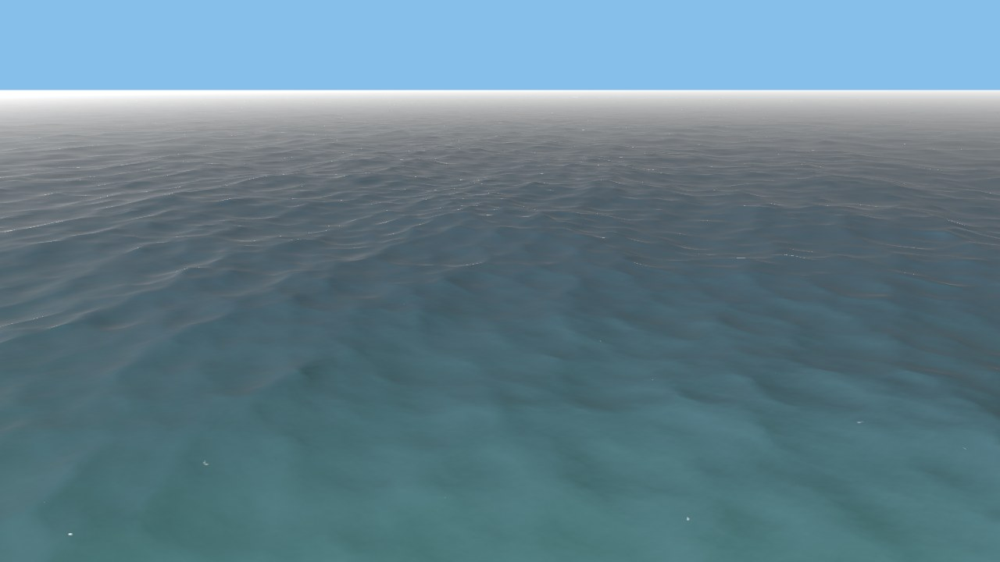 |
| `spectral_waves` | FFT spectral wave producer | 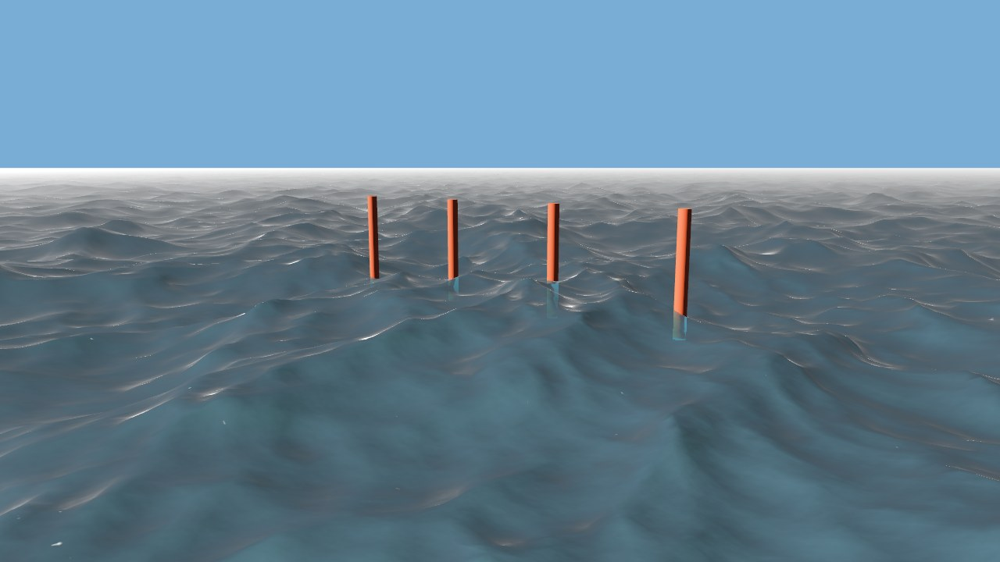 |
| `foam` | Persistent whitecaps on rough water | 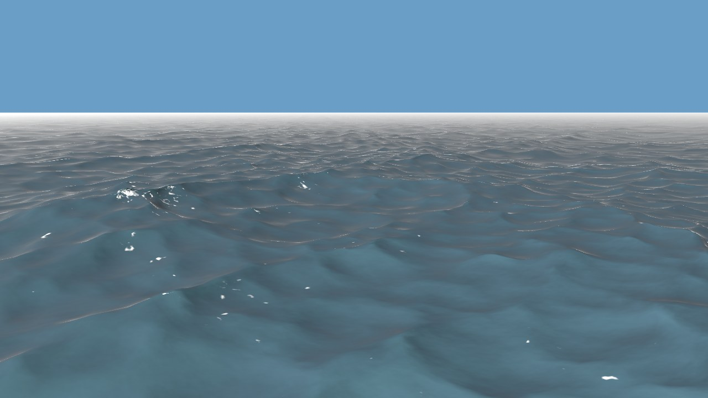 |
| `bounded_water` | Local circular and polygonal water bodies | 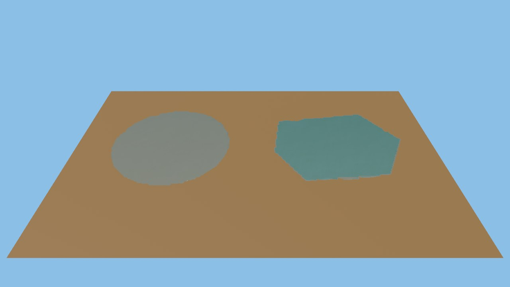 |
| `river` | Curved river flow with changing width and speed | 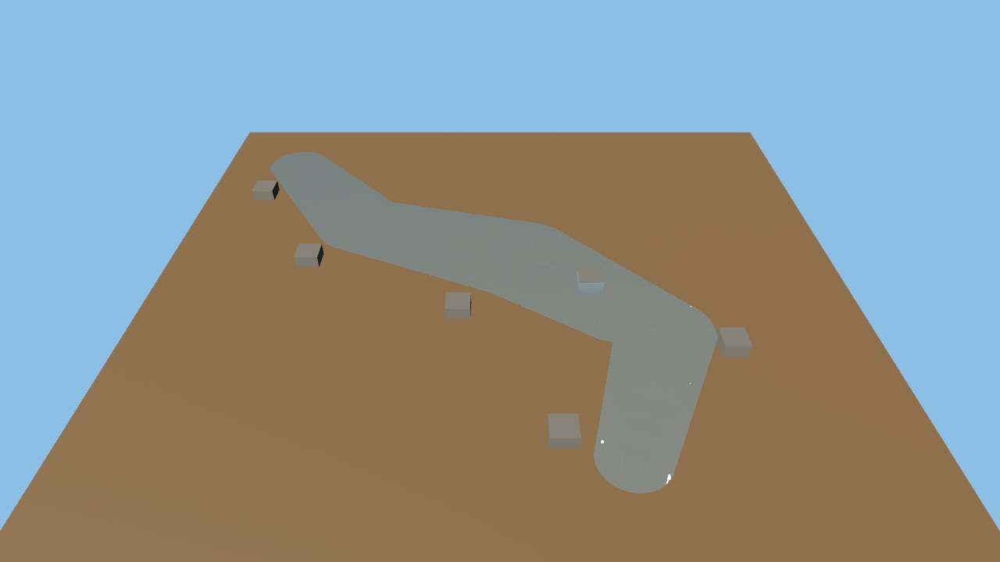 |
| `terrain_bed` | Terrain height input, shoaling, and shallow-water optics | 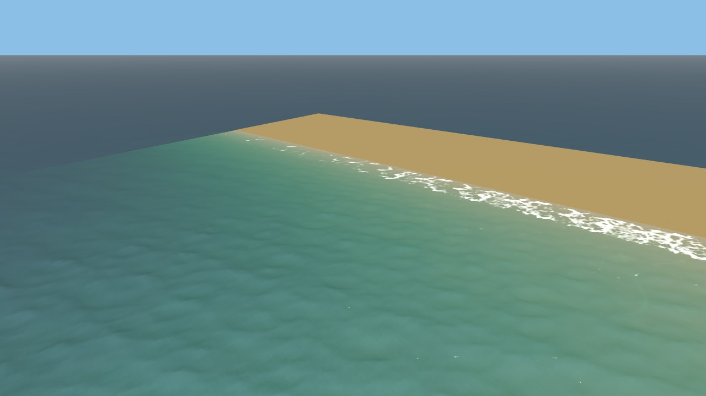 |
| `debug_views` | Automatic cycle through all Aqua diagnostics | 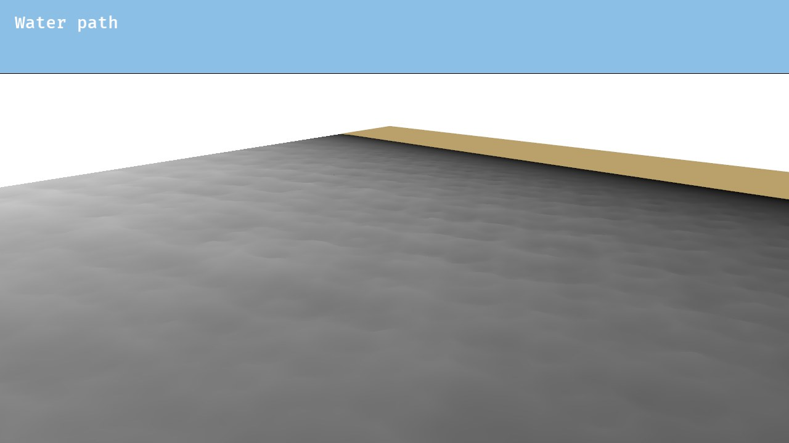 |
| `water_optics` | Water appearance presets shown side by side | 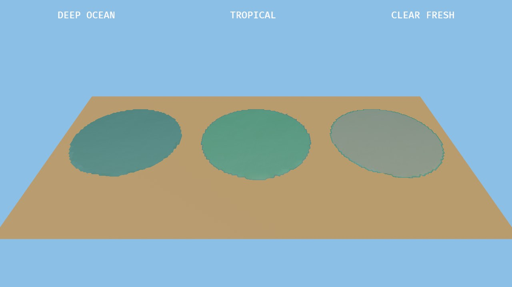 |
| `planar_reflection` | Planar reflection of marked scene geometry | 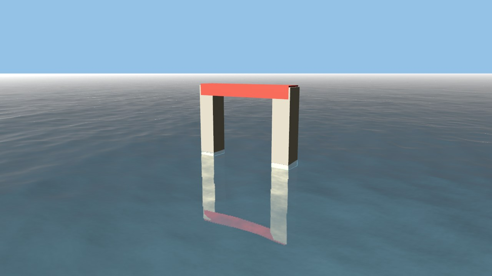 |
| `wave_query` | GPU surface queries driving a procedural buoy | 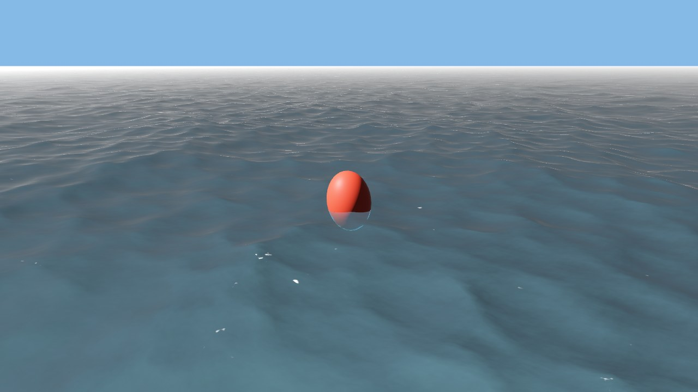 |

Run any scene natively:

```sh
cargo run --example ocean
```

The same source runs with browser WebGPU:

```sh
rustup target add wasm32-unknown-unknown
cargo install wasm-server-runner
CARGO_TARGET_WASM32_UNKNOWN_UNKNOWN_RUNNER=wasm-server-runner \
  cargo run --target wasm32-unknown-unknown --example ocean
```

See [`examples/README.md`](examples/README.md) for the full command list.

## AI disclosure

This project was developed with assistance from AI coding agents.

## Attribution

Aqua adapts established ocean-rendering techniques and includes attributed
third-party assets. See [ATTRIBUTION.md](ATTRIBUTION.md) for sources and
licenses.
